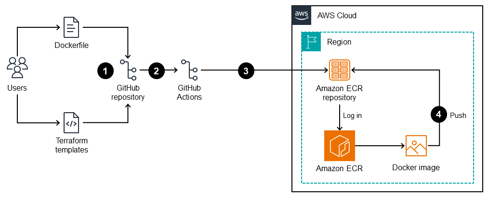

# ⚓ CI/CD Pipeline: Docker + GitHub Actions + AWS (ECR/EC2)

Este projeto implementa uma esteira de automação completa (CI/CD) para uma aplicação Node.js. O objetivo é demonstrar o fluxo de entrega contínua, onde cada atualização no código é automaticamente transformada em uma imagem Docker, armazenada no Amazon ECR e disponibilizada em uma instância EC2.

## 🏗️ Arquitetura do Projeto

A arquitetura segue o fluxo:
1. **GitHub**: Controle de versão e gatilho do pipeline.
2. **GitHub Actions**: Automatiza o build e push da imagem Docker.
3. **Amazon ECR**: Armazenamento seguro de imagens conteinerizadas.
4. **Amazon EC2**: Servidor final onde a aplicação roda via Docker.

## 🧠 Desafios e Soluções Técnicas (Troubleshooting)

### 1. Permissões do Docker no Linux
* **Problema:** Erro de `Permission Denied` ao rodar comandos Docker.
* **Solução:** Adicionei o `ec2-user` ao grupo `docker` (`sudo usermod -aG docker ec2-user`), permitindo a execução sem `sudo`, seguindo boas práticas de segurança.

### 2. Pipeline de CI/CD Seguro
* **Solução:** Utilizei **GitHub Secrets** para mascarar as credenciais da AWS, impedindo que chaves sensíveis fossem expostas no histórico do Git.

## 🛠️ Como Reproduzir
1. Clone o repositório: `git clone https://github.com/gustavogomes43/Projeto-AWS-Docker-CICD.git`
2. Configure os Secrets na aba **Settings > Secrets and variables > Actions**.
3. Realize um `git push` para a branch `main` e veja a automação na aba **Actions**.
